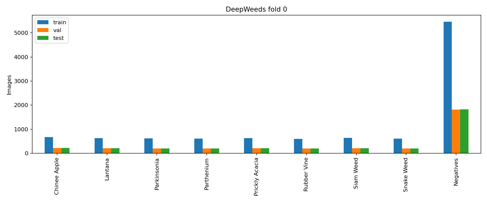
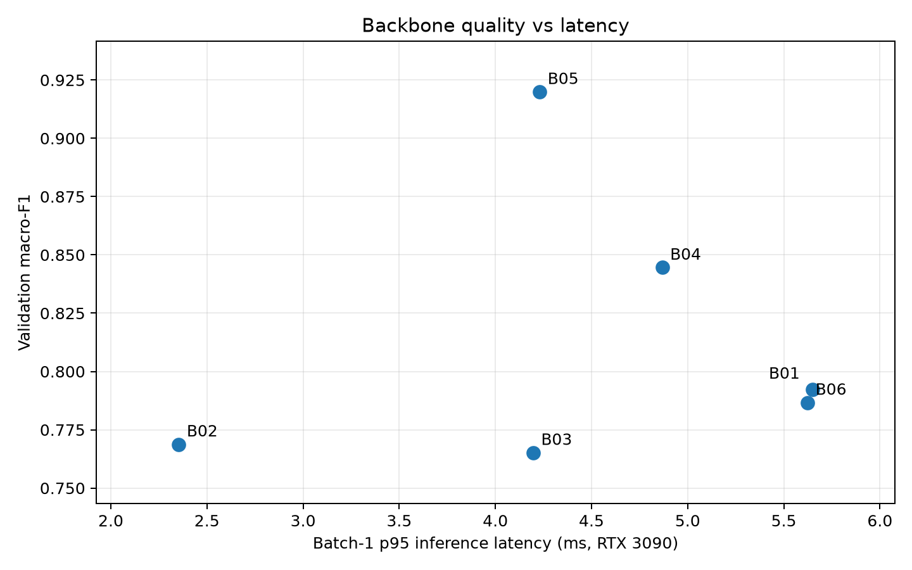
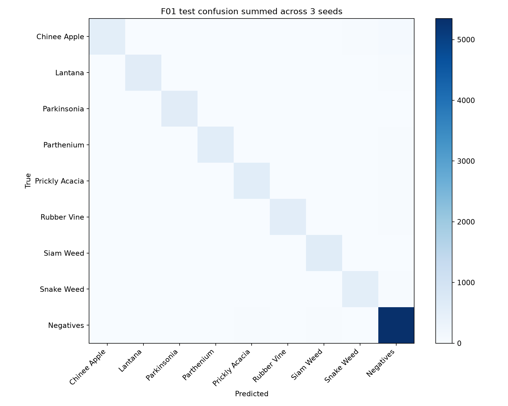
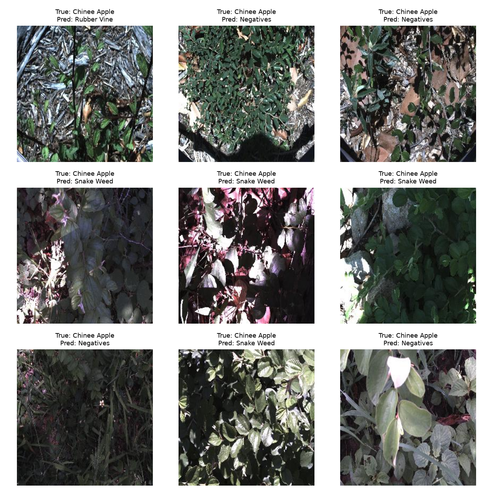

# DeepWeeds Lab Day 2

**Student:** Hà Mạnh Tuân · **ID:** 2A202602982

## Executive summary

On the original DeepWeeds fold 0, six backbones were compared on validation, three training axes were tested on the selected ViT Tiny, and five inference methods were compared before final test evaluation. The final recipe used pretrained ViT Tiny, RandAugment and two-view probability averaging. Across three seeds, its test macro-F1 was **0.9327 ± 0.0029** and top-1 accuracy was **94.84% ± 0.31 percentage points**. Macro-F1 exceeded the same-backbone baseline by **0.0140**, greater than the larger observed seed standard deviation (**0.0061**). The selected inference method had batch-1 p95 latency **9.17 ms** on an RTX 3090, excluding preprocessing. The supplied evaluation script assigned **14/20 provisional model-quality points**. The remaining weakness is Chinee Apple recall (**79.6%**). B06 was measured after final selection to complete the required ResNeXt comparison; it did not change the final model or test predictions.

## Data and method

Original DeepWeeds fold 0, 9 classes: **10,501 train**, **3,501 validation**, **3,507 test** images. The three sets are disjoint and cover all 17,509 images. Negatives account for 9,106 images (52.0%), versus 1,009–1,125 per weed class, matching Table 1 in the assignment's source paper. See `evidence/class_counts.png`, `evidence/sample_images.png`, and `evidence/split_check.json`. Macro-F1 averages F1 across all nine classes; top-1 measures the fraction of correct images. Both follow the unchanged repository `eval.py`.

Train updates weights; validation chooses checkpoints, backbone, recipe and inference; test is scored after selection. The baseline uses ImageNet pretrained weights, AdamW, backbone LR 1e-4, head LR 1e-3, cosine schedule with one warmup epoch, batch 64, 224 px images and mixed precision unless an experiment config says otherwise. Training images use random resized crop and horizontal flip; validation/test use resize 256, center crop 224 and ImageNet normalization. Screening runs use seed 0 and 10 epochs; final runs use seeds 0–2 and 12 epochs. The best validation macro-F1 checkpoint is retained without early stopping. Hardware: NVIDIA GeForce RTX 3090; Python 3.10.12, PyTorch 2.6.0+cu124, torchvision 0.21.0+cu124, timm 1.0.30 (full versions: `evidence/software.json`). Each run's exact config and history are in `run_metadata/`.

## Backbone comparison (validation)

| exp_id   | backbone             |   macro_f1_val |   top1_val |   params_m |     gmac |   seconds_per_epoch |
|:---------|:---------------------|---------------:|-----------:|-----------:|---------:|--------------------:|
| B01      | resnet50             |       0.79216  |   0.8489   |   23.5265  | 4.10948  |            13.2484  |
| B02      | resnet18             |       0.76874  |   0.830049 |   11.1811  | 1.81856  |             6.57532 |
| B03      | resnet34             |       0.765125 |   0.830905 |   21.2893  | 3.67076  |             8.70184 |
| B04      | regnetx_002          |       0.84455  |   0.884604 |    2.31911 | 0.203019 |             6.47946 |
| B05      | vit_tiny_patch16_224 |       0.919873 |   0.941445 |    5.52615 | 1.07939  |             6.68857 |
| B06      | resnext50_32x4d      |       0.786624 |   0.835476 |   22.99835 | 4.25735  |            16.02510 |

Selected: vit_tiny_patch16_224, highest validation macro-F1. B06 was added after the final model had been frozen; its lower validation score supports retaining that choice. The `Backbones` sheet also includes batch-1 p50/p95/p99 for all six candidates; `evidence/backbone_quality_latency.png` plots the measured quality-latency tradeoff. Pretrained tags are listed in the workbook, since differing ImageNet recipes affect this comparison.

## Training recipe (validation)

| exp_id   |   macro_f1_val |   top1_val |   best_epoch |
|:---------|---------------:|-----------:|-------------:|
| T00      |       0.919873 |   0.941445 |           10 |
| T01      |       0.595767 |   0.705513 |            6 |
| T02      |       0.60492  |   0.708083 |           10 |
| T03      |       0.921356 |   0.939732 |           10 |
| T04      |       0.926875 |   0.942588 |            8 |
| T05      |       0.910274 |   0.932876 |            9 |
| T06      |       0.900918 |   0.925164 |            8 |

Selected factors by validation: `{"aug": "randaug"}`. One factor changes at a time relative to T00; the combination is retrained.

## Inference selection (validation)

| exp_id   |   macro_f1 |        ece |
|:---------|-----------:|-----------:|
| I00      |   0.929012 | 0.0167979  |
| I01      |   0.931652 | 0.0103981  |
| I02      |   0.931554 | 0.0136155  |
| I03      |   0.929012 | 0.00703282 |
| I04      |   0.931554 | 0.007381   |

Selected method: I01. Temperature is fitted on validation only.

## Final test (three seeds)

| exp_id   |   seed | method   |   macro_f1 |     top1 |   balanced_acc |       ece |      nll |
|:---------|-------:|:---------|-----------:|---------:|---------------:|----------:|---------:|
| F00      |      0 | I00      |   0.912938 | 0.934417 |       0.90577  | 0.0239298 | 0.19885  |
| F00      |      1 | I00      |   0.918185 | 0.939835 |       0.922782 | 0.0194035 | 0.189942 |
| F00      |      2 | I00      |   0.925009 | 0.943541 |       0.922739 | 0.0139053 | 0.182001 |
| F01      |      0 | I01      |   0.932979 | 0.949244 |       0.924105 | 0.0105021 | 0.152944 |
| F01      |      1 | I01      |   0.935425 | 0.950955 |       0.926053 | 0.0117514 | 0.152236 |
| F01      |      2 | I01      |   0.929735 | 0.944967 |       0.921227 | 0.0141047 | 0.160393 |

Final macro-F1: 0.9327 +/- 0.0029; baseline: 0.9187; delta: +0.0140. The standard deviation is sample std (ddof=1).

## Per-class test F1, final configuration

| class          |   support |       f1 |
|:---------------|----------:|---------:|
| Chinee Apple   |       226 | 0.863671 |
| Lantana        |       213 | 0.943057 |
| Negatives      |      1822 | 0.966215 |
| Parkinsonia    |       207 | 0.970045 |
| Parthenium     |       205 | 0.942726 |
| Prickly Acacia |       213 | 0.912096 |
| Rubber Vine    |       202 | 0.952703 |
| Siam Weed      |       215 | 0.948349 |
| Snake Weed     |       204 | 0.895558 |

## Latency

| Method | Views | Batch | Precision | p50 (ms) | p95 (ms) | p99 (ms) |
|:---|---:|---:|:---|---:|---:|---:|
| I00 | 1 | 1 | fp32 | 4.50 | 4.52 | 4.55 |
| I00 | 1 | 1 | AMP | 6.05 | 6.13 | 6.20 |
| I00 | 1 | 32 | fp32 | 10.42 | 10.46 | 10.51 |
| I00 | 1 | 32 | AMP | 6.56 | 6.91 | 7.10 |
| I01/I02/I04 | 2 | 1 | model forward | 8.55 | 9.17 | 9.34 |

Latency excludes preprocessing, uses 10 warmup and 50 synchronized iterations. See `evidence/`, `curves/`, `predictions/`, and `results.xlsx` for available evidence. Single-seed screening is subject to noise; results may vary across GPU/software versions.

## Supplemental backbone comparison

B06 is ResNeXt-50 (`resnext50_32x4d`), trained with B01's fold, seed, epoch budget, optimizer and augmentation. It was added after the original final predictions were produced. The final backbone and test predictions were frozen before this supplemental experiment; B06 validation results were not used to choose or rerun test.

B06 validation macro-F1: 0.7866; top-1: 0.8355; parameters: 23.00M; GMAC: 4.25735168; train time: 16.03 s/epoch; batch-1 latency p50/p95/p99: 5.23/5.44/5.49 ms in its first measurement on NVIDIA GeForce RTX 3090. See `run_metadata/B06/seed0/`, `curves/B06_seed0.png`, `predictions/B06_seed0_val.csv`, and `evidence/B06_latency.json`.

## Validation error analysis

`evidence/F01_seed0_val_confusion.png` shows the validation confusion matrix. `evidence/F01_seed0_val_errors.png` shows misclassified validation images with their true and predicted classes. These images are for diagnosis; no test labels were used to select or change the model.

The aggregated three-seed **test** confusion matrix and nine Chinee Apple mistakes from F01 seed 0 are provided below as post-evaluation error analysis. They were generated from the already finalized predictions and were not used to alter the model or inference rule.

Several of these examples contain dense mixed foliage, partially obscured leaves, or strong shadows/highlights. Those visible conditions plausibly contribute to Chinee Apple being predicted as Negatives or Snake Weed, but the image gallery is illustrative; it does not establish a causal effect. On test, F01 Chinee Apple recall averaged **79.6%**, slightly below F00's **80.4%**, even though F01's overall macro-F1 improved. This is why the overall score should not replace per-class analysis.

## Interpretation and limitations

The original fold-0 split has 9,106 Negatives (52.0% of all images); each weed class has 1,009–1,125. This agrees with the class counts in the assignment's Table 1. Macro-F1 therefore matters alongside top-1 accuracy: a model could predict the dominant class often and still miss important weed species. Train, validation, and test contain 10,501, 3,501, and 3,507 distinct images, respectively (`evidence/split_check.json`).

B05 (ViT Tiny) achieved validation macro-F1 0.9199, versus 0.8446 for the next best screened backbone B04 (RegNetX-002). B06 (ResNeXt-50) reached 0.7866 after the final recipe had already been chosen, so the added ResNeXt comparison does not challenge that choice. B05 also trained in 6.69 seconds per epoch in this run, while B06 took 16.03 seconds. These are single-seed screening results; pretrained weights differ between model families, so architecture alone does not explain every difference.

Within the ViT training comparison, RandAugment increased validation macro-F1 from 0.9199 (T00) to 0.9269 (T04), a gain of 0.0070. Frozen-backbone and scratch initialization fell to 0.5958 and 0.6049. Label smoothing and focal loss were below the cross-entropy baseline in this run. Only RandAugment was selected; F01 retrained that choice with three seeds. The screening comparisons themselves use one seed, so small differences are uncertain.

F01 with two-view probability averaging (I01) achieved test macro-F1 **0.9327 ± 0.0029** and top-1 **0.9484 ± 0.0031** across three seeds. F00 achieved macro-F1 **0.9187 ± 0.0061**; the difference is **+0.0140**, greater than the larger observed seed standard deviation. On validation, I01 averaged 0.9317 macro-F1 versus 0.9290 for one-view I00, but its batch-1 p95 latency was **9.17 ms**, compared with **4.52 ms** for I00. Both are below the rubric's 100 ms budget. The final `eval.py grade` invocation uses the selected I01's **9.17 ms** latency, as recorded in `evidence/grade/grade_I.json`. Latency excludes image loading and preprocessing.

Temperature scaling reduced validation ECE for some inference candidates, but I01 was selected by mean validation macro-F1 and does not use temperature scaling. Thus the automatic grade correctly gives I4a zero for the submitted final predictions. No test results were used to change the selected inference method.

The validation confusion matrix for F01 seed 0 shows 22 Chinee Apple images predicted as Negatives and 14 as Snake Weed; 16 Snake Weed images were predicted as Negatives. The final test recall for Chinee Apple is 79.6%, below the paper's 88.5% reference. More varied images of those species or a separately validated class-focused training experiment would be the next areas to study; this run does not establish that either would improve test performance.

The study uses one predefined fold and only one seed for backbone and training screening. It uses fixed 10/12-epoch budgets and keeps the best validation checkpoint rather than stopping training early. A split from the same collection may overestimate performance on a new location, season, or camera. The submission includes plots, predictions, workbook, server logs, and `run_metadata/` with each run's config and history; large model checkpoints are omitted. Do not treat the measured GPU latency as end-to-end camera latency.

## Additional pipeline and backbone evidence

The retrospective GPU check in `evidence/pipeline_check.json` used a scratch MobileNetV3 Small and a fixed batch of nine images, one per class. Its initial cross-entropy was 2.0495 (the uniform nine-class reference is ln 9 = 2.1972); loss fell to 0.00000163 after 20 optimizer steps. This supports that the model can learn a tiny batch, but **this check was run after the full experiment**, not as a preflight. `evidence/augmentation_check.png` shows each selected original image beside its transformed input after reversing ImageNet normalization. The full per-step trace is in `evidence/one_batch_overfit.csv`.

The six backbone checkpoints were measured again on the RTX 3090 with batch size 1, fp32, 10 warmup iterations, 50 synchronized timing iterations, and no preprocessing. The results are in the `BackboneLatency` sheet and `evidence/backbone_quality_latency.png`. B05 had p95 **4.23 ms** and validation macro-F1 **0.9199**. B02 was fastest at **2.35 ms** but had macro-F1 **0.7687**; B04 reached **0.8446** at **4.87 ms**. B06's repeat p95 was **5.62 ms**, compared with **5.44 ms** in its first measurement, illustrating normal timing variation. B05 offered the strongest validation quality among the measured candidates while staying far below the 100 ms budget. The backbone screening uses different pretrained weight recipes and one seed, so these measurements do not isolate architecture alone.

## Conclusion and deployment recommendation

The largest observed validation difference came from backbone selection: B05 exceeded B04 by **0.0753** macro-F1. Within B05, the selected RandAugment change improved the single-seed screening result by **0.0070**, and I01 improved mean validation macro-F1 over I00 by **0.0026**. The latter two differences are small relative to the uncertainty of single-seed screening and should not be treated as universal gains. After training the final recipe with three seeds, the measured F01 test macro-F1 advantage over F00 was **0.0140**, larger than the observed seed standard deviation. For a robot with a 30–100 ms frame budget on hardware comparable to the measured RTX 3090, F01 with I01 is the quality-oriented choice at **9.17 ms p95 model latency**; F01 with a single view is a lower-cost candidate at **4.52 ms p95** but has lower mean validation macro-F1. End-to-end camera latency must be measured separately before deployment.

The supplied `eval.py grade` reported **14/20** provisional quality points: I1 5/7, I2 5/5, I3 1/4, I4a 0/1, I4b 1/1, I5 2/2. The final I5 invocation used the selected two-view I01 latency of **9.17 ms**, below the 100 ms criterion. Chinee Apple recall and calibration remain open issues. No post-test model or inference change was made to chase these thresholds.

## Reproduction appendix

All B01–B06, T00–T06, F00/F01 × seeds 0–2, and I00–I04 are represented in `results.xlsx`. Exact settings and per-epoch logs for the 19 training runs are in `run_metadata/<exp_id>/seed<seed>/`; the corresponding curves are in `curves/`. Training source is in `code/`, and the step order and versions are in `README.md`. Original server stdout is in `evidence/server.log`, with `supplement.log` and `audit.log` for the later B06 and retrospective checks. The original `eval.py` was not edited. Large model checkpoints and dataset images are intentionally excluded from the Git submission; the saved predictions are sufficient to recompute all reported test metrics.
